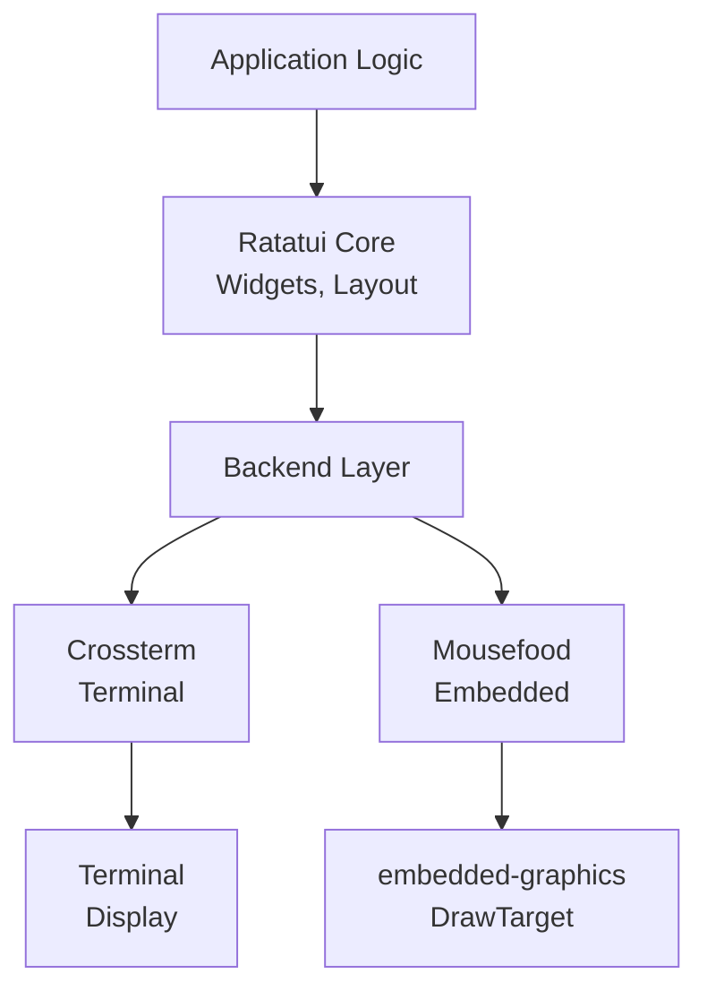

# WHO_AM_I

<!--column_layout: [1, 3]-->
<!--column: 0--> 

<!--new_lines: 5-->


<!--column: 1-->

```rust
fn main() {
  let WHO_AM_I: &str = "Vaishnav Sabari Girish";

  let designation: &str = "Final Year ECE Student";

  let mut interests: Vec<&str> = vec![
      "Open Source",
      "Embedded Systems",
      "Rust",
      "Linux",
      "CLI/TUI"
  ];

  let mut projects: Vec<&str> = vec![
      // Rust Projects
      "Hayasen",
      "ComChan (Serial Monitor)",
      "Arduino CLI Interactive",   // Except This one
  ];

  let website: &str = "https://vaishnav.world";
}
```

<!--end_slide-->

# What is `mousefood`

1. `embedded-graphics` backend for `ratatui`
2. Enables TUI applications on embedded displays (TFT Screens, OLED Screens)
3. Works with both `std` and `no_std` targets.

<!--end_slide-->

# The problem 

## Traditional `ratatui` limitations

1. Required terminal environments
2. Desktop/server focused
3. Memory footprint is high.

## Embedded display challenge

1. Limited character sets (ASCII Only)
2. Small screen real estate
3. Resource constraints

<!--end_slide-->

# Ratatui Architecture



<!--end_slide-->

# How `mousefood` solves it

1. **`embedded-graphics` integration** : Any `DrawTarget` can become a `ratatui` backend 
2. **Unicode font support** : Uses `embedded-graphics-unicodefonts` for box-drawing chars
3. **Simulator Mode** : Develop with SDL2 before deploying on hardware.

<!--end_slide-->

# Quick Start Code

```rust
use mousefood::prelude::*;

fn main() -> Result<(), error> {
    // Any embedded_graphics DrawTarget
    let mut display = MyDrawTarget::new();
    
    let backend = EmbeddedBackend::new(
        &mut display, 
        EmbeddedBackendConfig::default()
    );
    let mut terminal = Terminal::new(backend)?;
    
    loop {
        terminal.draw(|frame| {
            // Your Ratatui widgets here!
        })?;
    }
}
```

<!--end_slide-->

# Outputs 

<!--column_layout: [1, 1]-->
<!--column: 0-->

## Simulator Output


<!--column: 1-->

## Hardware Output


