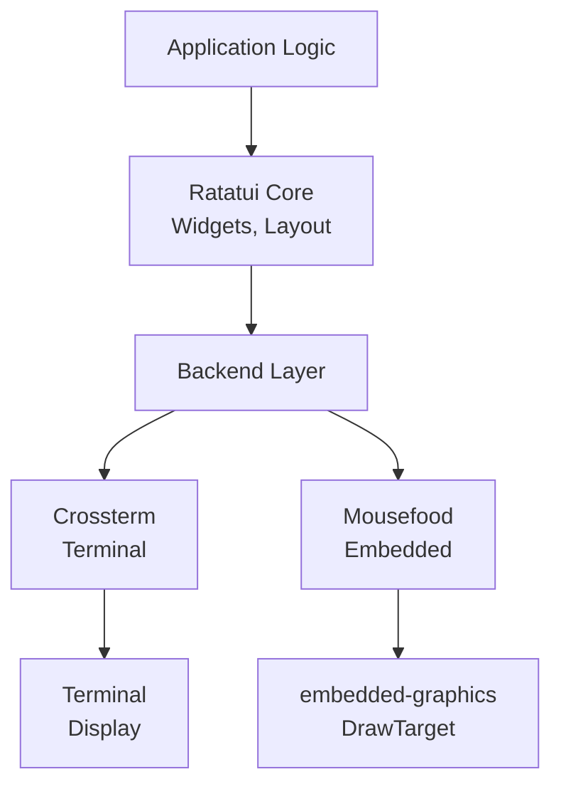
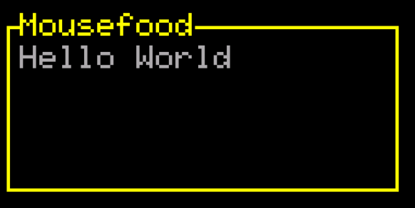
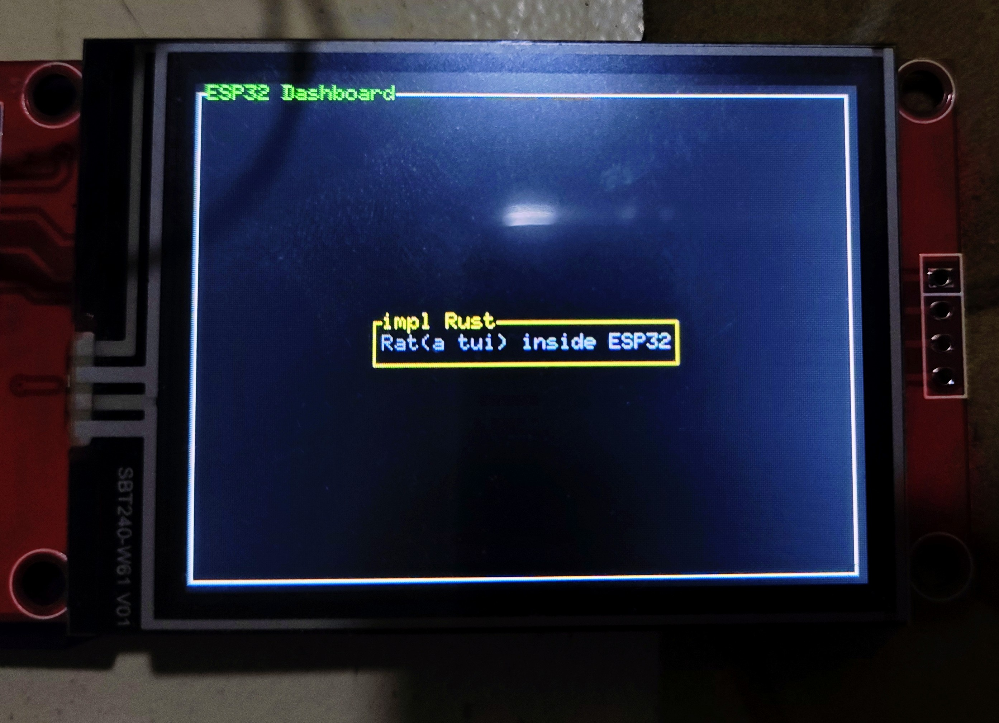
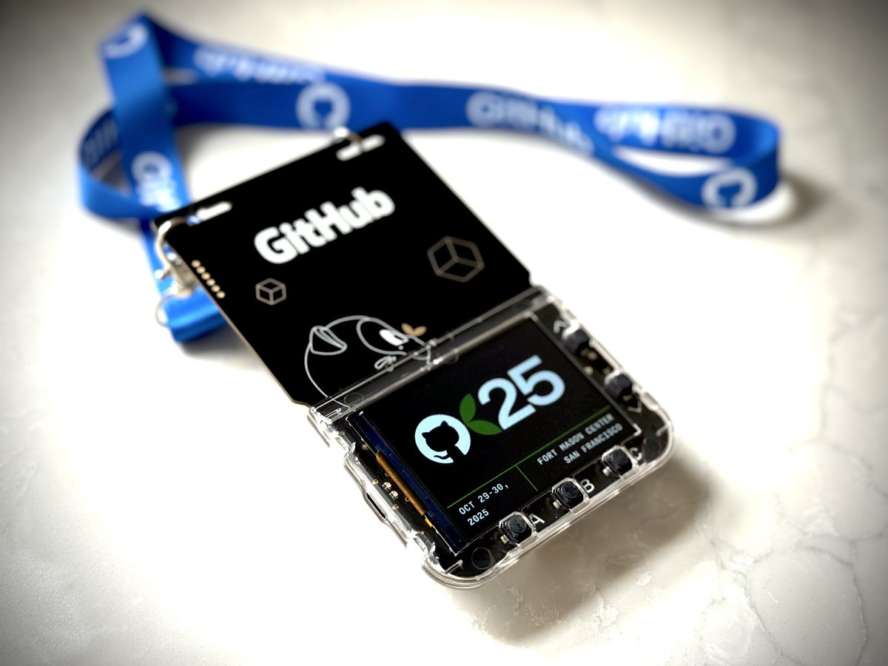

WHO_AM_I
===

<!--column_layout: [1, 3]-->
<!--column: 0--> 

<!--new_lines: 5-->


<!--column: 1-->

```rust
fn main() {
  let WHO_AM_I: &str = "Vaishnav Sabari Girish";

  let designation: &str = "Final Year ECE Student";

  let mut interests: Vec<&str> = vec![
      "Open Source",
      "Embedded Systems",
      "Rust",
      "Linux",
      "CLI/TUI"
  ];

  let mut projects: Vec<&str> = vec![
      // Rust Projects
      "AlertAngel",
      "ComChan (Serial Monitor)",
      "Hayasen",
  ];

  let website: &str = "https://vaishnav.world";
}
```

<!--end_slide-->

What is `mousefood`
===

<!--new_lines: 1-->
1. `embedded-graphics` backend for `ratatui`
<!--new_lines: 1-->
2. Enables TUI applications on embedded displays (TFT Screens, OLED Screens)
<!--new_lines: 1-->
3. Works with both `std` and `no_std` targets.
<!--new_lines: 1-->

<!--end_slide-->

The problem 
===

## Traditional `ratatui` limitations

<!--new_lines: 1-->
1. Required terminal environments
<!--new_lines: 1-->
2. Desktop/server focused
<!--new_lines: 1-->
3. Memory footprint is high.

## Embedded display challenge

<!--new_lines: 1-->
1. Limited character sets (ASCII Only)
<!--new_lines: 1-->
2. Small screen real estate
<!--new_lines: 1-->
3. Resource constraints

<!--end_slide-->

Ratatui Architecture
===



<!--end_slide-->

How `mousefood` solves it
===

<!--new_lines: 1-->
1. **`embedded-graphics` integration** : Any `DrawTarget` can become a `ratatui` backend 
<!--new_lines: 1-->
2. **Unicode font support** : Uses `embedded-graphics-unicodefonts` for box-drawing chars
<!--new_lines: 1-->
3. **Simulator Mode** : Develop with SDL2 before deploying on hardware.

<!--end_slide-->

Quick Start Code
===

```rust
use mousefood::prelude::*;

fn main() -> Result<(), error> {
    // Any embedded_graphics DrawTarget
    let mut display = MyDrawTarget::new();
    
    let backend = EmbeddedBackend::new(
        &mut display, 
        EmbeddedBackendConfig::default()
    );
    let mut terminal = Terminal::new(backend)?;
    
    loop {
        terminal.draw(|frame| {
            // Your Ratatui widgets here!
        })?;
    }
}
```

<!--end_slide-->

Outputs 
===

<!--column_layout: [1, 1]-->
<!--column: 0-->

## Simulator Output



<!--column: 1-->

## Hardware Output



<!--end_slide-->

Where can `mousefood` be used
===

<!--new_lines: 1-->
`mousefood` can be used on any microcontroller that supports `no_std` or `std` Embedded Rust.

Some examples are : 
1. `no_std` : 
  - RP2040
  - Nordic Microcontrollers
  - ESP32
2. `std` 
  - ESP32 

<!--end_slide-->

Widgets supported
===

Currently in `no_std` the core widgets of `ratatui` are supported. This includes widgets like `Layout`, `Block`, `Border`, `Paragraph`, `Terminal` etc. 

In `std` environments, most third-party widgets are also supported, like `tui-big-text`, `tui-popup` etc.

<!--end_slide-->

Using `mousefood` in your Rust program
===

To use `mousefood` on actual Hardware, currently you should add the latest versions of `ratatui` and `mousefood` to your `Cargo.toml`. This means that you will have to use the **Alpha** version of `ratatui` as shown below

## `Cargo.toml`

```toml
mousefood = { git = "https://github.com/j-g00da/mousefood", rev = "cc9f8fe372f09342537bc31a1355f77f2693d70b", default-features = false, features = [
  "fonts",
] }
ratatui = { version = "0.30.0-alpha.5", default-features = false }
```

<!--end_slide-->

Get started
===

To get started, I have created a repository which contains basic `ratatui` and `mousefood` programs for both Hardware (ESP32-WROOM) and Simulator (QR in next slide)

This is the link

```text
https://github.com/Vaishnav-Sabari-Girish/Mousefood-Programs
```

This is the shortened link

```text
https://t.ly/JpDDE
```

You can try the programs out by cloning this repository. 

<!--end_slide-->

Repository link 
===

```bash +exec
curl -s qrenco.de/https://t.ly/JpDDE
```


<!--end_slide-->

Projects that use `mousefood` (Notable ones)
===

1. Orhun Parmaksiz's (The legend himself) Tuitar : [](https://github.com/orhun/tuitar) 
<!--new_lines: 1-->
2. Mnyaoo32 (ESP32 IRC client) : [](https://github.com/intuis/mnyaoo32)
<!--new_lines: 1-->
3. Phone-OS (ESp32-CYD) : [](https://github.com/Julien-cpsn/Phone-OS)
<!--new_lines: 1-->

<!--end_slide-->

My personal project (Using `mousefood`, `ratatui` and `std`)
===

I am currently working on **AlertAngel**, a elderly monitoring system. 

It uses the following tech stack : 

## Hardware

1. Glyph C3 (ESP32-C3)
2. 2.4" TFT display (SSD1306)
3. Sensors (MPU9250, MAX30102, DS18B20)
4. Touch sensors

## Firmware 

1. `std` Embedded Rust

### Crates I am using (Some of them)

1. `ratatui` and `mousefood` for the UI on the screen
2. `mipidsi` for the display driver
3. `esp_idf_svc` for `std` support on ESP32

For more information visit  [](https://github.com/AlertAngel)

<!--end_slide-->

Inspiration 
===

The inspiration for the ID card form factor of **AlertAngel** came from the GitHub Universe badges which are unique. 

They have a microcontroller which you can program and display whatever you want in the screen of the ID card. 

Below is the image of a GitHub Universe ID card (Image Credit : **Martin Woodward**, via : **X**)




<!--end_slide-->

Some images
===

<!--column_layout: [1, 1]-->
<!--column: 0-->


<!--column: 1-->


<!--reset_layout-->

<!--alignment: center-->

You can also visit the website of **AlertAngel** (WIP)

[](https://alertangel.github.io)
<!--new_lines: 1-->
And also it's **GitHub** 
[](https://github.com/AlertAngel)

<!--end_slide-->

Links
===

<!--new_lines: 1-->

1. **Personal Website** : [](https://vaishnav.world)
<!--new_lines: 1-->
2. **GitHub** : [](https://github.com/Vaishnav-Sabari-Girish)
<!--new_lines: 1-->
3. **AlertAngel Website** : [](https://alertangel.github.io)
<!--new_lines: 1-->
4. **AlertAngel GitHub** : [](https://github.com/AlertAngel)

<!--end_slide-->


